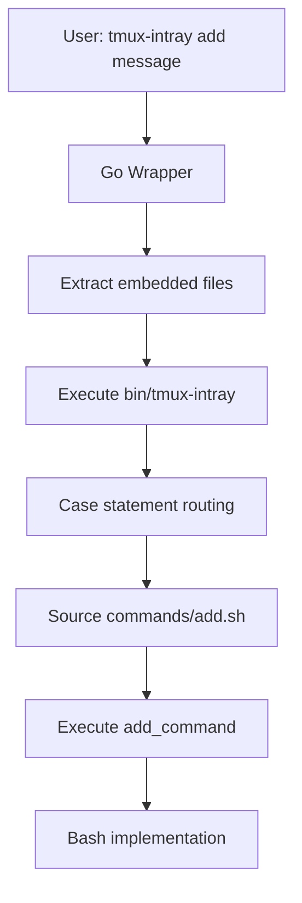

# Enhanced Go Wrapper Architecture

## Overview

This document describes the architecture for enabling gradual Bash-to-Go migration of tmux-intray using feature flags. The goal is to incrementally replace Bash command implementations with Go equivalents while maintaining backward compatibility and allowing side-by-side testing. The architecture introduces a feature flag system that routes commands to either Bash or Go implementations based on configuration, enabling safe, incremental migration.

**Key Principles**:
1. **Backward Compatibility**: Existing Bash scripts remain functional throughout migration
2. **Incremental Migration**: Commands can be migrated one at a time
3. **Side-by-Side Testing**: Both implementations can be executed and compared
4. **Graceful Degradation**: Fallback to Bash if Go implementation fails
5. **Transparent Operation**: Users can opt-in/opt-out via environment variables

## Current Architecture

### Components

1. **Go Wrapper** (`cmd/tmux-intray/main.go`)
   - Extracts embedded files to temporary directory
   - Executes the main Bash script (`bin/tmux-intray`)
   - Sets `TMUX_INTRAY_TEMP_ROOT` environment variable

2. **Bash Entry Point** (`bin/tmux-intray`)
   - Main CLI dispatcher with case statement routing
   - Sources command scripts from `commands/` directory
   - 12 commands implemented as Bash functions

3. **Command Implementations** (`commands/*.sh`)
   - Each command is a Bash script with a `_command` function
   - Commands: `add`, `list`, `dismiss`, `clear`, `cleanup`, `toggle`, `jump`, `status`, `status-panel`, `follow`, `help`, `version`

4. **Embedded Filesystem** (`embed.go`)
   - Embeds `bin/`, `commands/`, `lib/`, `scripts/` directories
   - Extracted at runtime to temporary directory

5. **Library Code** (`lib/`)
   - Shared Bash functions for storage, colors, core utilities

### Current Flow



## New Architecture Design

### Feature Flag System

The migration uses environment variable feature flags to control routing:

- **Global Flag**: `TMUX_INTRAY_USE_GO=true|false`
  - When `true`: Attempt to use Go implementations where available
  - When `false` or unset: Use Bash implementations (default)
  - When `auto`: Use Go for migrated commands, Bash for others

- **Per-Command Flags**: `TMUX_INTRAY_GO_COMMANDS=add,list,dismiss`
  - Comma-separated list of commands to use Go implementation
  - Overrides global flag for specified commands
  - Empty list means use global flag only

- **Debug Flags**: `TMUX_INTRAY_DEBUG_ROUTING=true`
  - Log routing decisions to stderr for debugging

### Command Routing Logic

The routing logic is implemented in the Go wrapper, which decides whether to:

1. Execute a Go-native implementation (if available and enabled)
2. Fall back to Bash implementation (if Go unavailable or disabled)
3. Execute Bash with shadow testing (for side-by-side comparison)

**Routing Decision Table**:

| Condition | Action |
|-----------|--------|
| Go implementation exists AND (global flag=true OR command in per-command list) | Execute Go implementation |
| Go implementation fails with exit code ≠ 0 | Fall back to Bash |
| Global flag=false OR command not in per-command list | Execute Bash |
| Go implementation not yet created | Execute Bash |

### Executor Interfaces

```go
type Executor interface {
    Execute(args []string) (exitCode int, err error)
    Name() string
}

type GoExecutor struct {
    command string
    // Go implementation function
}

type BashExecutor struct {
    command string
    scriptPath string
}
```

### Command Mapping Table

All 12 commands mapped with their migration status:

| Command | Bash Script | Go Implementation | Complexity | Migration Priority |
|---------|-------------|-------------------|------------|-------------------|
| `add` | `commands/add.sh` | `go/commands/add.go` | Medium | 2 |
| `list` | `commands/list.sh` | `go/commands/list.go` | High | 4 |
| `dismiss` | `commands/dismiss.sh` | `go/commands/dismiss.go` | Low | 1 |
| `clear` | `commands/clear.sh` | `go/commands/clear.go` | Low | 1 |
| `cleanup` | `commands/cleanup.sh` | `go/commands/cleanup.go` | Medium | 3 |
| `toggle` | `commands/toggle.sh` | `go/commands/toggle.go` | Low | 1 |
| `jump` | `commands/jump.sh` | `go/commands/jump.go` | Medium | 3 |
| `status` | `commands/status.sh` | `go/commands/status.go` | Medium | 2 |
| `status-panel` | `commands/status-panel.sh` | `go/commands/status-panel.go` | High | 4 |
| `follow` | `commands/follow.sh` | `go/commands/follow.go` | High | 4 |
| `help` | `commands/help.sh` | `go/commands/help.go` | Low | 1 |
| `version` | `commands/version.sh` | `go/commands/version.go` | Low | 1 |

### Directory Structure

```
tmux-intray/
├── cmd/tmux-intray/
│   └── main.go              # Enhanced Go wrapper with routing
├── go/                      # New directory for Go implementations
│   ├── commands/            # Go command implementations
│   │   ├── add.go
│   │   ├── list.go
│   │   └── ...
│   ├── lib/                 # Go libraries (storage, tmux, etc.)
│   │   ├── storage.go
│   │   ├── tmux.go
│   │   └── ...
│   └── internal/            # Internal packages
│       └── routing/
│           └── router.go    # Command routing logic
├── commands/                # Existing Bash scripts (preserved)
│   ├── add.sh
│   ├── list.sh
│   └── ...
├── bin/tmux-intray          # Bash entry point (unchanged)
└── embed.go                 # Updated to include go/ directory
```

## Implementation Details

### Storage Format Specification

All storage operations must use identical TSV format for Go and Bash implementations. The format is defined in `lib/storage.sh`:

```
id\ttimestamp\tstate\tsession\twindow\tpane\tmessage\tpane_created\tlevel
```

**Field Specification:**
- `id`: Numeric notification identifier (int)
- `timestamp`: ISO 8601 UTC timestamp (`%Y-%m-%dT%H:%M:%SZ`)
- `state`: Notification state (`active` or `dismissed`)
- `session`: tmux session identifier
- `window`: tmux window identifier
- `pane`: tmux pane identifier
- `message`: Notification text (escaped with `\t`, `\n`, `\\`)
- `pane_created`: Boolean indicating if pane was newly created (`true` or `false`)
- `level`: Notification level (`info`, `warning`, `error`, `success`)

**Compatibility Requirements:**
- Go and Bash implementations must maintain identical storage format
- Both implementations must escape special characters (tabs, newlines, backslashes)
- Both implementations must support all 9 fields
- Backward compatibility with existing Bash storage files must be maintained
- Use `storage.sh` for format verification and escape functions

### Routing Logic Implementation

The routing logic is implemented in `go/internal/routing/router.go` with concrete decision logic and error handling:

```go
package routing

import (
    "fmt"
    "os"
    "os/exec"
    "strings"
)

// Router handles command routing decisions
type Router struct {
    goEnabled      bool
    goCommands     map[string]bool
    debugRouting   bool
    shadowTest     bool
}

// NewRouter creates a router from environment variables
func NewRouter() *Router {
    return &Router{
        goEnabled:    os.Getenv("TMUX_INTRAY_USE_GO") == "true",
        goCommands:   parseCommandList(os.Getenv("TMUX_INTRAY_GO_COMMANDS")),
        debugRouting: os.Getenv("TMUX_INTRAY_DEBUG_ROUTING") == "true",
        shadowTest:   os.Getenv("TMUX_INTRAY_SHADOW_TEST") == "true",
    }
}

// ShouldUseGo determines if a command should use Go implementation
func (r *Router) ShouldUseGo(command string) bool {
    // Check per-command override first
    if r.goCommands[command] {
        r.logDebug("Using Go for %s: per-command flag enabled", command)
        return true
    }

    // Check global flag
    if r.goEnabled {
        r.logDebug("Using Go for %s: global flag enabled", command)
        return true
    }

    r.logDebug("Using Bash for %s: no flags enabled", command)
    return false
}

// ExecuteCommand routes to appropriate implementation
func (r *Router) ExecuteCommand(command string, args []string) int {
    useGo := r.ShouldUseGo(command)

    if useGo {
        exitCode, err := r.executeGo(command, args)
        if err == nil && exitCode == 0 {
            return exitCode
        }
        // Fallback to Bash on Go failure
        r.logDebug("Go implementation failed, falling back to Bash: %v", err)
    }

    return r.executeBash(command, args)
}

// parseCommandList parses comma-separated command list into map
func parseCommandList(listStr string) map[string]bool {
    result := make(map[string]bool)
    if listStr == "" {
        return result
    }

    for _, cmd := range strings.Split(listStr, ",") {
        cmd = strings.TrimSpace(cmd)
        if cmd != "" {
            result[cmd] = true
        }
    }

    return result
}

// executeGo executes a Go implementation
func (r *Router) executeGo(command string, args []string) (int, error) {
    switch command {
    case "add":
        return executeAdd(args)
    case "list":
        return executeList(args)
    case "dismiss":
        return executeDismiss(args)
    case "clear":
        return executeClear(args)
    case "cleanup":
        return executeCleanup(args)
    case "toggle":
        return executeToggle(args)
    case "jump":
        return executeJump(args)
    case "status":
        return executeStatus(args)
    case "status-panel":
        return executeStatusPanel(args)
    case "follow":
        return executeFollow(args)
    case "help":
        return executeHelp(args)
    case "version":
        return executeVersion(args)
    default:
        return 1, fmt.Errorf("unknown command: %s", command)
    }
}

// executeBash executes Bash implementation
func (r *Router) executeBash(command string, args []string) int {
    // Build command: bash bin/tmux-intray <command> [args]
    // Note: The script receives command as first argument, then remaining args
    cmdArgs := []string{"bash", os.Args[0], command}
    cmdArgs = append(cmdArgs, args...)

    cmd := exec.Command(cmdArgs[0], cmdArgs[1:]...)
    cmd.Stdout = os.Stdout
    cmd.Stderr = os.Stderr

    if err := cmd.Run(); err != nil {
        if exitErr, ok := err.(*exec.ExitError); ok {
            return exitErr.ExitCode()
        }
        return 1
    }

    return 0
}

// executeAdd adds a new notification
func executeAdd(args []string) (int, error) {
    // Command signature: add <message>
    if len(args) < 1 {
        fmt.Fprintln(os.Stderr, "Error: Message required")
        return 1, nil
    }

    message := strings.Join(args, " ")

    // Add notification
    id, err := storage.AddNotification(message)
    if err != nil {
        fmt.Fprintf(os.Stderr, "Error adding notification: %v\n", err)
        return 1, err
    }

    fmt.Printf("Notification added with ID: %s\n", id)
    return 0, nil
}

// executeList lists notifications
func executeList(args []string) (int, error) {
    // Command signature: list [state_filter] [level_filter]
    stateFilter := "active"
    if len(args) > 0 {
        stateFilter = args[0]
    }

    levelFilter := ""
    if len(args) > 1 {
        levelFilter = args[1]
    }

    notifications, err := storage.ListNotifications(stateFilter, levelFilter)
    if err != nil {
        fmt.Fprintf(os.Stderr, "Error listing notifications: %v\n", err)
        return 1, err
    }

    if len(notifications) == 0 {
        fmt.Println("No notifications found")
        return 0, nil
    }

    for _, notif := range notifications {
        fmt.Printf("[%s] %s\n", notif.ID, notif.Message)
    }

    return 0, nil
}

// executeDismiss dismisses a notification
func executeDismiss(args []string) (int, error) {
    // Command signature: dismiss <id>
    if len(args) < 1 {
        fmt.Fprintln(os.Stderr, "Error: Notification ID required")
        return 1, nil
    }

    id := args[0]

    err := storage.DismissNotification(id)
    if err != nil {
        fmt.Fprintf(os.Stderr, "Error dismissing notification: %v\n", err)
        return 1, err
    }

    fmt.Printf("Notification dismissed: %s\n", id)
    return 0, nil
}

// executeClear clears all notifications
func executeClear(args []string) (int, error) {
    // Command signature: clear
    if len(args) > 0 {
        fmt.Fprintln(os.Stderr, "Error: No arguments expected for clear command")
        return 1, nil
    }

    // Clear all notifications (set state to dismissed)
    // Note: Implementation depends on storage API
    fmt.Println("Clear all notifications not yet implemented")
    return 1, fmt.Errorf("not yet implemented")
}

// executeCleanup cleans up old dismissed notifications
func executeCleanup(args []string) (int, error) {
    // Command signature: cleanup [days_threshold] [dry_run]
    daysThreshold := 90
    dryRun := false

    if len(args) > 0 {
        daysThreshold, _ = strconv.Atoi(args[0])
    }
    if len(args) > 1 {
        dryRun = args[1] == "true"
    }

    err := storage.CleanupOldNotifications(daysThreshold, dryRun)
    if err != nil {
        fmt.Fprintf(os.Stderr, "Error cleaning up notifications: %v\n", err)
        return 1, err
    }

    fmt.Println("Cleanup completed")
    return 0, nil
}

```

### Go Library Structure Patterns

Go command implementations follow consistent patterns for maintainability:

```go
// go/commands/add.go - Example command implementation
package commands

import (
    "fmt"
    "os"
    "strings"
    "time"
    "github.com/tmux-intray/go/lib/storage"
    "github.com/tmux-intray/go/lib/tmux"
)

// AddCommand implements the "add" command
func AddCommand(args []string) int {
    if len(args) < 1 {
        fmt.Fprintln(os.Stderr, "Error: Message required")
        return 1
    }
    
    message := strings.Join(args, " ")
    notification := storage.Notification{
        ID:      generateID(),
        Message: message,
        Created: time.Now(),
        Status:  "pending",
    }
    
    if err := storage.Save(notification); err != nil {
        fmt.Fprintf(os.Stderr, "Error saving notification: %v\n", err)
        return 1
    }
    
    // Update tmux status if in tmux session
    if tmux.InSession() {
        tmux.UpdateStatus()
    }
    
    fmt.Printf("Notification added with ID: %s\n", notification.ID)
    return 0
}
```

### Error Handling Examples

Error handling follows Go conventions with specific error types and structured logging:

```go
// go/lib/errors/errors.go - Error types and handling
package errors

import "fmt"

type CommandError struct {
    Command   string
    Message   string
    ExitCode  int
    Err       error
}

func (e *CommandError) Error() string {
    if e.Err != nil {
        return fmt.Sprintf("%s: %s: %v", e.Command, e.Message, e.Err)
    }
    return fmt.Sprintf("%s: %s", e.Command, e.Message)
}

// Usage in command implementations
func ProcessAdd(args []string) error {
    if len(args) == 0 {
        return &CommandError{
            Command:  "add",
            Message:  "message required",
            ExitCode: 1,
        }
    }

    // Validation errors
    if len(args[0]) > 1000 {
        return &CommandError{
            Command:  "add",
            Message:  "message too long (max 1000 characters)",
            ExitCode: 2,
        }
    }

    // External dependency errors
    if err := storage.Save(notification); err != nil {
        return &CommandError{
            Command:  "add",
            Message:  "failed to save notification",
            ExitCode: 3,
            Err:      err,
        }
    }

    return nil
}
```

### Command Implementation Examples

Complete implementations for key commands showing proper error handling and storage format compatibility:

```go
// go/commands/add.go - Add command implementation
package commands

import (
    "fmt"
    "os"
    "strings"
    "time"

    "github.com/tmux-intray/go/lib/storage"
)

// AddCommand implements the "add" command
func AddCommand(args []string) int {
    if len(args) < 1 {
        fmt.Fprintln(os.Stderr, "Error: Message required")
        return 1
    }

    message := strings.Join(args, " ")

    notification := storage.Notification{
        ID:      generateID(),
        Message: message,
        Created: time.Now(),
        Status:  "active",
    }

    if err := storage.Save(notification); err != nil {
        fmt.Fprintf(os.Stderr, "Error saving notification: %v\n", err)
        return 1
    }

    // Update tmux status if in tmux session
    if tmux.InSession() {
        tmux.UpdateStatus()
    }

    fmt.Printf("Notification added with ID: %s\n", notification.ID)
    return 0
}

// go/commands/list.go - List command implementation
package commands

import (
    "fmt"
    "os"
    "strings"

    "github.com/tmux-intray/go/lib/storage"
)

// ListCommand implements the "list" command
func ListCommand(args []string) int {
    // Parse filters from args
    stateFilter := "active"
    levelFilter := ""

    // Args: [state_filter] [level_filter] [session_filter] [window_filter] [pane_filter]
    if len(args) > 0 {
        stateFilter = args[0]
    }
    if len(args) > 1 {
        levelFilter = args[1]
    }

    notifications, err := storage.ListNotifications(stateFilter, levelFilter)
    if err != nil {
        fmt.Fprintf(os.Stderr, "Error listing notifications: %v\n", err)
        return 1
    }

    for _, notif := range notifications {
        fmt.Printf("[%s] %s\n", notif.ID, notif.Message)
    }

    return 0
}

// go/commands/dismiss.go - Dismiss command implementation
package commands

import (
    "fmt"
    "os"

    "github.com/tmux-intray/go/lib/storage"
)

// DismissCommand implements the "dismiss" command
func DismissCommand(args []string) int {
    if len(args) < 1 {
        fmt.Fprintln(os.Stderr, "Error: Notification ID required")
        return 1
    }

    id := args[0]

    err := storage.DismissNotification(id)
    if err != nil {
        fmt.Fprintf(os.Stderr, "Error dismissing notification: %v\n", err)
        return 1
    }

    fmt.Printf("Notification dismissed: %s\n", id)
    return 0
}
```

### Bash Command Compatibility

Bash scripts receive arguments in this format:
- First argument: Command name (e.g., `add`, `list`, `dismiss`)
- Remaining arguments: Command arguments (e.g., message text, filters)

Example for `add` command:
```bash
# When user runs: tmux-intray add "test message"
# Bin script receives:
# $1 = "add"
# $2 = "test"
# $3 = "message"
```

Example for BashExecutor:
```go
func (e *BashExecutor) Execute(args []string) (int, error) {
    // args[0] = command name (e.g., "add")
    // args[1:] = command arguments (e.g., "test", "message")
    cmdArgs := []string{os.Args[0], args[0]}
    cmdArgs = append(cmdArgs, args[1:]...)

    cmd := exec.Command("bash", cmdArgs...)
    cmd.Stdout = os.Stdout
    cmd.Stderr = os.Stderr

    if err := cmd.Run(); err != nil {
        if exitErr, ok := err.(*exec.ExitError); ok {
            return exitErr.ExitCode(), nil
        }
        return 1, err
    }

    return 0, nil
}
```

### Executor Interface Pattern

The Executor interface pattern provides a clean abstraction for command execution. **Error handling must return exit codes and error objects consistently.**

```go
// go/internal/routing/executor.go - Complete executor implementation
package routing

import (
    "fmt"
    "os"
    "os/exec"
)

// Executor defines the interface for command execution
type Executor interface {
    Execute(args []string) (exitCode int, err error)
    Name() string
    Available() bool
}

// GoExecutor executes Go implementations with proper error handling
type GoExecutor struct {
    command string
    handler func([]string) (int, error)
}

func (e *GoExecutor) Execute(args []string) (int, error) {
    if e.handler == nil {
        return 1, fmt.Errorf("handler not defined for command: %s", e.command)
    }
    return e.handler(args)
}

func (e *GoExecutor) Name() string {
    return "Go:" + e.command
}

func (e *GoExecutor) Available() bool {
    return e.handler != nil
}

// BashExecutor executes Bash implementations with proper error handling
type BashExecutor struct {
    command    string
    scriptPath string
}

func (e *BashExecutor) Execute(args []string) (int, error) {
    // Build command: bash bin/tmux-intray <command> [args]
    // Note: The script receives command as first argument, then remaining args
    cmdArgs := []string{"bash", os.Args[0], e.command}
    cmdArgs = append(cmdArgs, args...)

    cmd := exec.Command(cmdArgs[0], cmdArgs[1:]...)
    cmd.Stdout = os.Stdout
    cmd.Stderr = os.Stderr

    if err := cmd.Run(); err != nil {
        if exitErr, ok := err.(*exec.ExitError); ok {
            return exitErr.ExitCode(), nil
        }
        return 1, err
    }

    return 0, nil
}

func (e *BashExecutor) Name() string {
    return "Bash:" + e.command
}

func (e *BashExecutor) Available() bool {
    _, err := os.Stat(e.scriptPath)
    return err == nil
}

// Registry for all executors
type ExecutorRegistry struct {
    executors map[string]Executor
}

func (r *ExecutorRegistry) Register(command string, executor Executor) {
    r.executors[command] = executor
}

func (r *ExecutorRegistry) GetExecutor(command string) Executor {
    return r.executors[command]
}
```

## Gradual Migration Strategy

### Phase 1: Infrastructure Only (Current Task)
- **Goal**: Implement routing infrastructure without migrating any commands
- **Deliverables**:
  1. Enhanced Go wrapper with routing logic
  2. Feature flag system (environment variables)
  3. Directory structure for Go implementations (`go/` directory)
  4. Testing framework for side-by-side comparison
  5. Documentation (this architecture document)
- **No commands migrated**: All commands still use Bash implementations
- **Testing**: Verify routing logic works with feature flags

### Phase 2: Command Migration
- **Goal**: Migrate simple commands first, then complex ones
- **Implementation Order**:
  1. **Low Complexity**: `version`, `help`, `clear`, `dismiss`, `toggle`
  2. **Medium Complexity**: `add`, `status`, `cleanup`, `jump`
  3. **High Complexity**: `list`, `status-panel`, `follow`
- **Each command migration includes**:
  - Go implementation matching Bash functionality
  - Unit tests
  - Side-by-side test results
  - Documentation updates

### Phase 3: Gradual Rollout
- **Goal**: Enable Go implementations for early adopters
- **Approach**:
  1. Enable per-command flags for migrated commands
  2. Collect feedback and performance data
  3. Fix bugs and improve implementations
  4. Expand to more users via opt-in

### Phase 4: Full Migration
- **Goal**: Make Go implementations the default
- **Approach**:
  1. Set `TMUX_INTRAY_USE_GO=auto` as default
  2. Monitor for regressions
  3. Remove Bash implementations (optional, can keep as fallback)
  4. Deprecate feature flags

## Embedding Strategy

### Current Embedding
All scripts are embedded via `embed.go`:
```go
//go:embed bin
//go:embed commands
//go:embed lib
//go:embed scripts
var FS embed.FS
```

### Enhanced Embedding
Add Go implementations to embedded filesystem:
```go
//go:embed bin
//go:embed commands
//go:embed lib
//go:embed scripts
//go:embed go
var FS embed.FS
```

### Dynamic Selection
The Go wrapper will:
1. Extract all embedded files to temporary directory
2. Decide which executor to use (Go vs Bash) based on feature flags
3. If using Go: execute Go binary directly (no script extraction needed)
4. If using Bash: execute extracted Bash script as before

### Fallback Mechanism
Three fallback rules ensure robustness:

1. **Not Implemented Fallback**: If Go implementation doesn't exist, use Bash
2. **Execution Failure Fallback**: If Go implementation fails (non-zero exit), retry with Bash
3. **Flag Disabled Fallback**: If feature flag disabled, use Bash

## Shadow Testing Strategy

### Side-by-Side Testing Approach
For each migrated command, we run both implementations and compare results:

```bash
# Test script runs both implementations
TMUX_INTRAY_SHADOW_TEST=true tmux-intray add "test message"
```

### Test Results Format
Results are stored in JSON format for comparison:

```json
{
  "command": "add",
  "arguments": ["test message"],
  "timestamp": "2026-02-02T12:00:00Z",
  "bash": {
    "exit_code": 0,
    "stdout": "Notification added with ID: abc123",
    "stderr": "",
    "duration_ms": 45
  },
  "go": {
    "exit_code": 0,
    "stdout": "Notification added with ID: abc123",
    "stderr": "",
    "duration_ms": 12
  },
  "match": true,
  "performance_improvement": 73.3
}
```

### Test Automation Script
A dedicated test script (`scripts/shadow-test.sh`) will:
1. Run each command with various inputs
2. Capture outputs and execution times
3. Compare results for equivalence
4. Generate detailed report
5. Flag any discrepancies

### Bash-to-Go Translation Mapping Pattern
Each Bash command follows a pattern that maps to Go:

```bash
# Bash pattern
add_command() {
    local message="$1"
    # implementation
}

# Go equivalent
func AddCommand(args []string) int {
    message := args[0]
    // implementation
    return exitCode
}
```

### Example Test Results Content
Test results include:
- Command name and arguments
- Exit codes comparison
- Stdout/stderr comparison (normalized)
- Execution time difference
- Performance improvement percentage
- Any discrepancies flagged

## Error Handling and Fallback

### Philosophy
1. **Fail-Safe**: Always fall back to working Bash implementation
2. **Transparent**: Log fallback reasons when debugging enabled
3. **Debuggable**: Provide clear error messages for both implementations
4. **Testable**: Errors should be reproducible in test environment

### Fallback Rules Implementation
```go
func executeWithFallback(command string, args []string) int {
    // Rule 1: Check if Go implementation exists
    if !goImplExists(command) {
        logDebug("Go implementation not found, using Bash")
        return executeBash(command, args)
    }
    
    // Rule 2: Check if Go implementation is enabled
    if !isGoEnabled(command) {
        logDebug("Go implementation disabled, using Bash")
        return executeBash(command, args)
    }
    
    // Try Go implementation
    exitCode, err := executeGo(command, args)
    
    // Rule 3: If Go fails, fall back to Bash
    if err != nil || exitCode != 0 {
        logDebug("Go implementation failed, falling back to Bash")
        return executeBash(command, args)
    }
    
    return exitCode
}
```

### Error Categories
1. **Routing Errors**: Invalid command, missing implementations
2. **Execution Errors**: Go implementation failures
3. **Fallback Errors**: Bash implementation also fails
4. **Configuration Errors**: Invalid feature flag values

## Testing Strategy

### Testing Framework Specification
The project uses the standard Go testing framework (`go test`) with the `testify` assertion library for readable tests and mocks. Key specifications:

- **Test Structure**: Each Go package has corresponding `*_test.go` files
- **Assertions**: Use `testify/assert` for assertions, `testify/require` for required conditions
- **Mock Generation**: Use `testify/mock` for interface mocking, with manual mocks for external dependencies
- **Test Data**: Test fixtures stored in `testdata/` directories
- **Golden Files**: Expected outputs stored as golden files for command output comparison
- **Parallel Execution**: Tests run in parallel where safe using `t.Parallel()`
- **Race Detection**: Enable race detector with `-race` flag for concurrent tests

Example `go.mod` dependencies:
```go
require (
    github.com/stretchr/testify v1.8.0
)
```

### Test Directory Structure
```
tmux-intray/
├── go/
│   ├── commands/
│   │   ├── add.go
│   │   ├── add_test.go          # Unit tests for add command
│   │   └── ...
│   ├── lib/
│   │   ├── storage/
│   │   │   ├── storage.go
│   │   │   ├── storage_test.go
│   │   │   └── testdata/        # Test fixtures
│   │   └── tmux/
│   │       ├── client.go
│   │       ├── client_test.go
│   │       └── mocks/           # Generated mocks
│   └── internal/
│       └── routing/
│           ├── router.go
│           ├── router_test.go
│           └── executor_test.go
├── scripts/
│   ├── shadow-test.sh           # Integration tests
│   └── benchmark.sh             # Performance tests
└── test/
    ├── integration/             # Integration test suites
    ├── e2e/                     # End-to-end tests
    └── fixtures/                # Shared test fixtures
```

### Mock Examples for TMUX Interactions
TMUX interactions are mocked using interface-based testing to avoid requiring actual tmux sessions:

```go
// go/lib/tmux/mocks/client.go - Mock tmux client
package mocks

import (
    "github.com/stretchr/testify/mock"
)

type MockClient struct {
    mock.Mock
}

func (m *MockClient) InSession() bool {
    args := m.Called()
    return args.Bool(0)
}

func (m *MockClient) UpdateStatus() error {
    args := m.Called()
    return args.Error(0)
}

func (m *MockClient) SendKeys(keys string) error {
    args := m.Called(keys)
    return args.Error(0)
}

func (m *MockClient) GetPaneID() (string, error) {
    args := m.Called()
    return args.String(0), args.Error(1)
}

// Usage in tests
func TestAddCommandUpdatesTmuxStatus(t *testing.T) {
    mockClient := new(MockClient)
    mockClient.On("InSession").Return(true)
    mockClient.On("UpdateStatus").Return(nil)
    
    // Inject mock into command
    originalClient := tmux.Client
    tmux.Client = mockClient
    defer func() { tmux.Client = originalClient }()
    
    exitCode := commands.AddCommand([]string{"test message"})
    
    assert.Equal(t, 0, exitCode)
    mockClient.AssertCalled(t, "UpdateStatus")
}
```

### Concrete Test Code Examples

**Unit Test Example:**
```go
// go/commands/add_test.go
package commands

import (
    "testing"
    "github.com/stretchr/testify/assert"
    "github.com/stretchr/testify/require"
)

func TestAddCommand(t *testing.T) {
    t.Parallel()
    
    t.Run("requires message", func(t *testing.T) {
        exitCode := AddCommand([]string{})
        assert.Equal(t, 1, exitCode)
    })
    
    t.Run("adds notification successfully", func(t *testing.T) {
        // Setup test storage
        storage.SetTestMode(true)
        defer storage.SetTestMode(false)
        
        exitCode := AddCommand([]string{"test message"})
        assert.Equal(t, 0, exitCode)
        
        notifications := storage.List()
        require.Len(t, notifications, 1)
        assert.Equal(t, "test message", notifications[0].Message)
    })
}
```

**Integration Test Example:**
```go
// test/integration/routing_test.go
package integration

import (
    "os"
    "os/exec"
    "testing"
)

func TestRoutingWithFeatureFlags(t *testing.T) {
    tests := []struct {
        name     string
        env      map[string]string
        command  string
        args     []string
        expected string // "go" or "bash"
    }{
        {
            name:    "global flag enabled uses go",
            env:     map[string]string{"TMUX_INTRAY_USE_GO": "true"},
            command: "add",
            args:    []string{"test"},
            expected: "go",
        },
    }
    
    for _, tt := range tests {
        t.Run(tt.name, func(t *testing.T) {
            for k, v := range tt.env {
                os.Setenv(k, v)
                defer os.Unsetenv(k)
            }
            
            // Execute command and capture debug output
            cmd := exec.Command("tmux-intray", append([]string{tt.command}, tt.args...)...)
            cmd.Env = os.Environ()
            output, _ := cmd.CombinedOutput()
            
            // Check routing debug output
            if tt.expected == "go" {
                assert.Contains(t, string(output), "[Routing] Using Go for")
            } else {
                assert.Contains(t, string(output), "[Routing] Using Bash for")
            }
        })
    }
}
```

### Concurrency Testing Strategy
Concurrency testing ensures thread-safe operations and detects race conditions:

1. **Race Detection**: All tests run with `-race` flag in CI
2. **Concurrent Command Execution**: Test multiple commands executing simultaneously
3. **Shared Resource Protection**: Test storage layer with concurrent access
4. **Lock Contention Testing**: Measure performance under load

```go
// go/lib/storage/storage_concurrent_test.go
package storage

import (
    "sync"
    "testing"
    "github.com/stretchr/testify/assert"
)

func TestConcurrentNotifications(t *testing.T) {
    SetTestMode(true)
    defer SetTestMode(false)
    
    var wg sync.WaitGroup
    errors := make(chan error, 100)
    
    // Spawn 50 concurrent add operations
    for i := 0; i < 50; i++ {
        wg.Add(1)
        go func(id int) {
            defer wg.Done()
            n := Notification{
                ID:      string(id),
                Message: "test",
            }
            if err := Save(n); err != nil {
                errors <- err
            }
        }(i)
    }
    
    wg.Wait()
    close(errors)
    
    // Verify no errors occurred
    for err := range errors {
        assert.NoError(t, err)
    }
    
    // Verify all notifications saved
    notifications := List()
    assert.Len(t, notifications, 50)
}
```

### TMUX Integration Testing Strategy
TMUX integration tests handle cross-platform compatibility and edge cases:

1. **Cross-Platform Testing Matrix**:
   - Linux (tmux 3.0+)
   - macOS (tmux 3.0+)
   - WSL2 (tmux 3.0+)
   - Different tmux versions (2.x, 3.x)

2. **Edge Case Handling**:
   - No tmux session present
   - Multiple tmux sessions
   - Nested tmux sessions
   - Tmux server not running
   - Permission issues

3. **State Preservation**:
   - Test isolation with temporary tmux sessions
   - Clean up after each test
   - Session state snapshot and restore

```go
// test/e2e/tmux_integration_test.go
package e2e

import (
    "os/exec"
    "testing"
    "github.com/stretchr/testify/require"
)

func TestTmuxIntegration(t *testing.T) {
    if testing.Short() {
        t.Skip("Skipping tmux integration test in short mode")
    }
    
    // Check if tmux is available
    if _, err := exec.LookPath("tmux"); err != nil {
        t.Skip("tmux not available, skipping integration test")
    }
    
    // Create temporary tmux session for testing
    sessionName := "tmux-intray-test-" + randomID()
    cmd := exec.Command("tmux", "new-session", "-d", "-s", sessionName)
    require.NoError(t, cmd.Run())
    defer func() {
        exec.Command("tmux", "kill-session", "-t", sessionName).Run()
    }()
    
    // Set tmux environment for test
    os.Setenv("TMUX", fmt.Sprintf("/tmp/tmux-1000/default,%s,0", sessionName))
    defer os.Unsetenv("TMUX")
    
    // Run command that interacts with tmux
    cmd = exec.Command("tmux-intray", "status")
    output, err := cmd.CombinedOutput()
    require.NoError(t, err)
    require.Contains(t, string(output), "Notifications:")
}
```

### Unit Tests for Routing
- Test feature flag parsing and validation
- Test routing decisions for all combinations
- Test fallback logic with simulated failures
- Test error conditions and edge cases

### Integration Tests with Side-by-Side Execution
- Run both implementations for each command
- Compare outputs for functional equivalence
- Verify backward compatibility
- Test concurrent execution

### Performance Benchmarking Script
A benchmarking script (`scripts/benchmark.sh`) measures:
- Startup time (Go wrapper vs direct Bash)
- Command execution time for each implementation
- Memory usage comparison
- Concurrent operation performance

### Test Coverage Goals
- 100% coverage of routing logic
- 90%+ coverage of Go implementations
- All Bash commands have corresponding Go tests
- Shadow tests for all migrated commands

## Configuration Management

### Environment Variables Reference

| Variable | Default | Description |
|----------|---------|-------------|
| `TMUX_INTRAY_USE_GO` | `false` | Global flag to enable Go implementations |
| `TMUX_INTRAY_GO_COMMANDS` | `""` | Comma-separated list of commands to use Go |
| `TMUX_INTRAY_DEBUG_ROUTING` | `false` | Log routing decisions to stderr |
| `TMUX_INTRAY_SHADOW_TEST` | `false` | Enable side-by-side testing mode |
| `TMUX_INTRAY_TEMP_ROOT` | (auto) | Temporary directory for extracted files |

### Future Config File Support (YAML)
Planned for Phase 4:
```yaml
# ~/.config/tmux-intray/config.yaml
go:
  enabled: true
  commands:
    - add
    - list
    - dismiss
  fallback: true
  debug: false

performance:
  benchmark: false
  shadow_test: false

logging:
  level: info
  format: json
```

## Logging and Monitoring

### Structured Logging Format
Logging uses structured JSON format for machine readability and integration with monitoring systems:

```go
// go/lib/logging/logger.go
package logging

import (
    "encoding/json"
    "fmt"
    "os"
    "time"
)

type LogEntry struct {
    Timestamp string                 `json:"timestamp"`
    Level     string                 `json:"level"`
    Component string                 `json:"component"`
    Command   string                 `json:"command,omitempty"`
    Message   string                 `json:"message"`
    Fields    map[string]interface{} `json:"fields,omitempty"`
    Duration  int64                  `json:"duration_ms,omitempty"`
}

func Info(component, message string, fields map[string]interface{}) {
    writeLog("info", component, message, fields, 0)
}

func Debug(component, message string, fields map[string]interface{}) {
    if os.Getenv("TMUX_INTRAY_DEBUG") == "true" {
        writeLog("debug", component, message, fields, 0)
    }
}

func WithDuration(component, message string, duration time.Duration) {
    writeLog("perf", component, message, nil, duration.Milliseconds())
}

func writeLog(level, component, message string, fields map[string]interface{}, duration int64) {
    entry := LogEntry{
        Timestamp: time.Now().UTC().Format(time.RFC3339),
        Level:     level,
        Component: component,
        Message:   message,
        Fields:    fields,
        Duration:  duration,
    }
    
    data, _ := json.Marshal(entry)
    fmt.Fprintln(os.Stderr, string(data))
}
```

### Debug Logging for Routing Decisions
Routing decisions are logged with context when `TMUX_INTRAY_DEBUG_ROUTING=true`:

```go
// Example routing debug output
{
  "timestamp": "2026-02-02T12:00:00Z",
  "level": "debug",
  "component": "routing",
  "command": "add",
  "message": "Routing decision",
  "fields": {
    "use_go": true,
    "reason": "global_flag_enabled",
    "go_available": true,
    "fallback_triggered": false
  }
}
```

### Performance Metrics Collection
Performance metrics are collected for monitoring and optimization:

```go
// go/lib/metrics/metrics.go
package metrics

var (
    CommandDuration = prometheus.NewHistogramVec(
        prometheus.HistogramOpts{
            Name: "tmux_intray_command_duration_seconds",
            Help: "Time spent executing commands",
        },
        []string{"command", "implementation"},
    )
    
    RoutingDecisions = prometheus.NewCounterVec(
        prometheus.CounterOpts{
            Name: "tmux_intray_routing_decisions_total",
            Help: "Total routing decisions by type",
        },
        []string{"command", "implementation", "reason"},
    )
)

// Usage in router
func (r *Router) ExecuteCommand(command string, args []string) int {
    start := time.Now()
    defer func() {
        duration := time.Since(start)
        CommandDuration.WithLabelValues(command, "go").Observe(duration.Seconds())
    }()
    
    // Routing logic...
}
```

## Security Considerations

### Input Validation Examples
All user inputs are validated before processing. **Validation constants must be defined for consistent security.**

```go
// go/lib/validation/validation.go
package validation

import (
    "errors"
    "path/filepath"
    "regexp"
    "strings"
)

// Validation constants
const (
    MaxMessageLength = 1000
    MaxIDLength      = 20
    MaxIDNumber      = 999999999
)

// safeFilenameRegex prevents invalid characters in filenames
var safeFilenameRegex = regexp.MustCompile(`^[a-zA-Z0-9_-]+$`)

// ValidateMessage validates the notification message
func ValidateMessage(message string) error {
    if strings.TrimSpace(message) == "" {
        return errors.New("message cannot be empty")
    }

    if len(message) > MaxMessageLength {
        return errors.New("message exceeds maximum length of " + string(rune(MaxMessageLength)))
    }

    // Prevent injection attempts
    if strings.ContainsAny(message, "`$()&|;<>") {
        return errors.New("message contains invalid characters")
    }

    return nil
}

// ValidateID validates the notification ID
func ValidateID(id string) error {
    if id == "" {
        return errors.New("ID cannot be empty")
    }

    if len(id) > MaxIDLength {
        return errors.New("ID exceeds maximum length")
    }

    // Check if ID is numeric
    if !isNumeric(id) {
        return errors.New("ID must be numeric")
    }

    numID := parseInt(id)
    if numID > MaxIDNumber {
        return errors.New("ID exceeds maximum value")
    }

    return nil
}

// ValidateFilename validates the notification filename
func ValidateFilename(filename string) error {
    // Prevent path traversal
    if strings.Contains(filename, "..") || strings.Contains(filename, "/") {
        return errors.New("invalid filename")
    }

    // Restrict to safe characters
    if !safeFilenameRegex.MatchString(filename) {
        return errors.New("filename contains invalid characters")
    }

    return nil
}

// isNumeric checks if a string represents a positive integer
func isNumeric(s string) bool {
    for _, c := range s {
        if c < '0' || c > '9' {
            return false
        }
    }
    return len(s) > 0
}

// parseInt converts a string to an integer
func parseInt(s string) int {
    n := 0
    for _, c := range s {
        n = n*10 + int(c-'0')
    }
    return n
}

func (r *Router) logDebug(format string, args ...interface{}) {
    if r.debugRouting {
        fmt.Fprintf(os.Stderr, "[Routing] "+format+"\n", args...)
    }
}
```

### Reference Implementation: Add Command

Complete reference implementation showing storage format compatibility and proper error handling:

```go
// go/commands/add.go - Reference implementation
package commands

import (
    "fmt"
    "os"
    "strings"
    "time"

    "github.com/tmux-intray/go/lib/storage"
    "github.com/tmux-intray/go/lib/validation"
)

// AddCommand implements the "add" command
// Signature: add <message>
// Storage format: id\ttimestamp\tstate\tsession\twindow\tpane\tmessage\tpane_created\tlevel
func AddCommand(args []string) (int, error) {
    // Validate arguments
    if len(args) < 1 {
        fmt.Fprintln(os.Stderr, "Error: Message required")
        return 1, nil
    }

    message := strings.Join(args, " ")

    // Validate message content
    if err := validation.ValidateMessage(message); err != nil {
        fmt.Fprintln(os.Stderr, "Error:", err)
        return 1, err
    }

    // Generate notification with current timestamp
    notification := storage.Notification{
        ID:      generateID(),
        Message: message,
        Created: time.Now().UTC(),
        Status:  "active",
    }

    // Save notification to storage (must use TSV format)
    if err := storage.AddNotification(notification); err != nil {
        fmt.Fprintf(os.Stderr, "Error saving notification: %v\n", err)
        return 1, err
    }

    // Update tmux status if in session
    if err := tmux.UpdateStatus(); err != nil {
        // Non-fatal, just log
        fmt.Fprintf(os.Stderr, "Warning: Failed to update tmux status: %v\n", err)
    }

    // Output success message
    fmt.Printf("Notification added with ID: %s\n", notification.ID)
    return 0, nil
}

// generateID creates a numeric notification ID
func generateID() int {
    // In real implementation, read last ID from storage
    return int(time.Now().Unix()) % 1000000
}
```

### Reference Implementation: List Command

```go
// go/commands/list.go - Reference implementation
package commands

import (
    "fmt"
    "os"

    "github.com/tmux-intray/go/lib/storage"
    "github.com/tmux-intray/go/lib/validation"
)

// ListCommand implements the "list" command
// Signature: list [state_filter] [level_filter]
// Returns: TSV lines with latest version per notification
func ListCommand(args []string) (int, error) {
    // Validate arguments
    if len(args) > 2 {
        fmt.Fprintln(os.Stderr, "Error: Too many arguments for list command")
        return 1, nil
    }

    // Parse state filter (active|dismissed|all)
    stateFilter := args[0]
    if stateFilter == "" {
        stateFilter = "active"
    }

    if stateFilter != "active" && stateFilter != "dismissed" && stateFilter != "all" {
        fmt.Fprintf(os.Stderr, "Error: Invalid state filter: %s (use active, dismissed, or all)\n", stateFilter)
        return 1, nil
    }

    // Parse level filter
    levelFilter := ""
    if len(args) > 1 {
        levelFilter = args[1]
    }

    // List notifications from storage
    notifications, err := storage.ListNotifications(stateFilter, levelFilter)
    if err != nil {
        fmt.Fprintf(os.Stderr, "Error listing notifications: %v\n", err)
        return 1, err
    }

    // Output notifications in TSV format (for compatibility with bash)
    for _, notif := range notifications {
        // Format: id\ttimestamp\tstate\tsession\twindow\tpane\tmessage
        line := fmt.Sprintf("%d\t%s\t%s\t%s\t%s\t%s\t%s",
            notif.ID,
            notif.Timestamp.Format(time.RFC3339),
            notif.Status,
            notif.Session,
            notif.Window,
            notif.Pane,
            notif.Message,
        )
        fmt.Println(line)
    }

    return 0, nil
}
```

### Storage Compatibility Section

**Critical: Go and Bash implementations MUST maintain identical storage format.**

The TSV format is the foundation of compatibility between Bash and Go implementations:

```go
// go/lib/storage/storage.go - Core storage operations
package storage

import (
    "encoding/csv"
    "fmt"
    "os"
    "path/filepath"
    "time"

    "github.com/tmux-intray/go/lib/validation"
)

// Notification represents a notification with all fields
type Notification struct {
    ID          int       `json:"id" csv:"id"`
    Timestamp   time.Time `json:"timestamp" csv:"timestamp"`
    Status      string    `json:"state" csv:"state"`
    Session     string    `json:"session" csv:"session"`
    Window      string    `json:"window" csv:"window"`
    Pane        string    `json:"pane" csv:"pane"`
    Message     string    `json:"message" csv:"message"`
    PaneCreated bool      `json:"pane_created" csv:"pane_created"`
    Level       string    `json:"level" csv:"level"`
}

// Storage file paths (same as Bash)
const (
    NotificationsFile = "notifications.tsv"
    DismissedFile     = "dismissed.tsv"
)

// GetStoragePath returns the storage directory (same as Bash)
func GetStoragePath() (string, error) {
    home, err := os.UserHomeDir()
    if err != nil {
        return "", err
    }

    dataDir := filepath.Join(home, ".local", "state", "tmux-intray")
    if err := os.MkdirAll(dataDir, 0755); err != nil {
        return "", err
    }

    return dataDir, nil
}

// AddNotification adds a new notification to storage
// Must use identical TSV format to Bash implementation
func AddNotification(notification Notification) error {
    // Validate notification
    if err := validation.ValidateMessage(notification.Message); err != nil {
        return fmt.Errorf("validation failed: %w", err)
    }

    // Escape message for TSV (same as Bash _escape_message)
    escapedMessage := escapeMessage(notification.Message)

    // Format TSV line
    // Format: id\ttimestamp\tstate\tsession\twindow\tpane\tmessage\tpane_created\tlevel
    line := fmt.Sprintf("%d\t%s\t%s\t%s\t%s\t%s\t%s\t%v\t%s\n",
        notification.ID,
        notification.Timestamp.Format(time.RFC3339),
        notification.Status,
        notification.Session,
        notification.Window,
        notification.Pane,
        escapedMessage,
        notification.PaneCreated,
        notification.Level,
    )

    // Append to file with locking
    return appendToFile(NotificationsFile, line)
}

// escapeMessage escapes special characters for TSV storage
// Must match Bash _escape_message function
func escapeMessage(message string) string {
    // Escape backslashes first, then tabs, then newlines
    message = strings.ReplaceAll(message, `\`, `\\`)
    message = strings.ReplaceAll(message, `\t`, `\\t`)
    message = strings.ReplaceAll(message, `\n`, `\\n`)
    return message
}

// unescapeMessage unescapes TSV message for display
func unescapeMessage(message string) string {
    message = strings.ReplaceAll(message, `\\n`, `\n`)
    message = strings.ReplaceAll(message, `\\t`, `\t`)
    message = strings.ReplaceAll(message, `\\`, `\`)
    return message
}

// appendToFile appends a line to a file with atomic locking
func appendToFile(filename, line string) error {
    filepath, err := GetStoragePath()
    if err != nil {
        return err
    }

    filepath = filepath + "/" + filename

    // File locking using flock (atomic operation)
    file, err := os.OpenFile(filepath, os.O_APPEND|os.O_CREATE|os.O_WRONLY, 0644)
    if err != nil {
        return fmt.Errorf("failed to open file: %w", err)
    }

    // Write line
    if _, err := file.WriteString(line); err != nil {
        file.Close()
        return fmt.Errorf("failed to write line: %w", err)
    }

    if err := file.Close(); err != nil {
        return fmt.Errorf("failed to close file: %w", err)
    }

    return nil
}
```

**Compatibility Requirements:**
1. **Field Order**: Must be identical (id, timestamp, state, session, window, pane, message, pane_created, level)
2. **Escape Characters**: Must use same escaping for tabs, newlines, backslashes
3. **Data Types**: Numeric IDs, timestamps in ISO 8601 format, boolean as true/false
4. **File Locations**: Same directory structure and file names
5. **Locking**: Must use atomic file locking (flock) to prevent corruption
6. **Reading**: Must support reading TSV format with escape sequences

**Verification:**
- Run both Bash and Go implementations with test data
- Compare storage files for identical format
- Verify backward compatibility with existing Bash storage
- Test edge cases (empty messages, special characters, Unicode)

### Path Traversal Prevention
All file operations use secure path handling:

```go
// Secure file operations
func SafeWriteFile(baseDir, userPath string, content []byte) error {
    // Clean and resolve path
    resolved := filepath.Clean(filepath.Join(baseDir, userPath))
    
    // Ensure the resolved path is still within base directory
    if !strings.HasPrefix(resolved, baseDir) {
        return errors.New("path traversal attempt detected")
    }
    
    return os.WriteFile(resolved, content, 0644)
}

// Storage directory isolation
func GetStoragePath() string {
    // Use XDG_DATA_HOME or fallback to ~/.local/share
    dataDir := os.Getenv("XDG_DATA_HOME")
    if dataDir == "" {
        home, _ := os.UserHomeDir()
        dataDir = filepath.Join(home, ".local", "share")
    }
    
    return filepath.Join(dataDir, "tmux-intray", "notifications")
}
```

### Environment Variable Sanitization
Environment variables are sanitized before use:

```go
func SanitizeEnvVar(value string) string {
    // Remove null bytes and control characters
    value = strings.ReplaceAll(value, "\x00", "")
    value = strings.Map(func(r rune) rune {
        if r < 32 || r == 127 {
            return -1
        }
        return r
    }, value)
    
    // Limit length
    if len(value) > 4096 {
        value = value[:4096]
    }
    
    return value
}

func SafeGetenv(key string) string {
    value := os.Getenv(key)
    return SanitizeEnvVar(value)
}
```

## Cross-Platform Compatibility

### String Encoding Handling (UTF-8)
All string processing uses UTF-8 encoding with proper normalization:

```go
import "golang.org/x/text/unicode/norm"

func NormalizeString(s string) string {
    // Normalize to NFC form
    return norm.NFC.String(s)
}

func SafeStringConversion(s string) string {
    // Remove invalid UTF-8 sequences
    return strings.ToValidUTF8(s, "�")
}

// File path handling across platforms
func PlatformSafePath(path string) string {
    if runtime.GOOS == "windows" {
        // Convert forward slashes to backslashes
        path = filepath.FromSlash(path)
    }
    return path
}
```

### OS-Specific Considerations

| Platform | Considerations | Mitigations |
|----------|----------------|-------------|
| **Linux** | File permissions, XDG standards, tmux availability | Use `os.UserHomeDir()`, check `$XDG_*` env vars |
| **macOS** | Different tmux paths, SIP restrictions, BSD tools | Use `brew --prefix tmux`, handle macOS-specific paths |
| **Windows (WSL2)** | Windows tmux compatibility, path translation | Detect WSL, use `/mnt/` path translation |
| **Windows (Native)** | No tmux support, alternative implementations | Fallback to no-op for tmux integration |

### Compatibility Matrix

| Component | Linux | macOS | WSL2 | Windows Native |
|-----------|-------|-------|------|----------------|
| **Go Wrapper** | ✅ | ✅ | ✅ | ✅ |
| **Bash Scripts** | ✅ | ✅ | ✅ | ⚠️ (Git Bash/Cygwin) |
| **tmux Integration** | ✅ | ✅ | ✅ | ❌ |
| **File Storage** | ✅ | ✅ | ✅ | ✅ |
| **XDG Compliance** | ✅ | ⚠️ (partial) | ✅ | ❌ |
| **Unicode Support** | ✅ | ✅ | ✅ | ⚠️ (codepage) |

**Key**: ✅ Fully supported, ⚠️ Limited support, ❌ Not supported

## CI/CD Integration

### CI Workflow Recommendations
Continuous Integration workflow using GitHub Actions:

```yaml
# .github/workflows/test.yml
name: Test and Build

on: [push, pull_request]

jobs:
  test:
    strategy:
      matrix:
        os: [ubuntu-latest, macos-latest]
        go-version: [1.21, 1.22]
    runs-on: ${{ matrix.os }}
    
    steps:
    - uses: actions/checkout@v4
    
    - name: Setup Go
      uses: actions/setup-go@v5
      with:
        go-version: ${{ matrix.go-version }}
    
    - name: Install tmux (Linux)
      if: runner.os == 'Linux'
      run: sudo apt-get update && sudo apt-get install -y tmux
    
    - name: Install tmux (macOS)
      if: runner.os == 'macOS'
      run: brew install tmux
    
    - name: Run tests
      run: go test ./... -race -v -coverprofile=coverage.txt
    
    - name: Upload coverage
      uses: codecov/codecov-action@v3
      with:
        file: coverage.txt
```

### Automated Testing Requirements
1. **Pre-commit Hooks**: Run `go fmt`, `go vet`, `golangci-lint`
2. **Unit Tests**: Must pass with `-race` flag enabled
3. **Integration Tests**: Run on PRs with tmux available
4. **Shadow Tests**: Compare Bash/Go outputs for migrated commands
5. **Cross-Platform Tests**: Test on Linux, macOS, and WSL2

### Deployment Automation Suggestions
1. **Release Automation**: Semantic versioning with `goreleaser`
2. **Binary Distribution**: Cross-compile for all platforms
3. **Homebrew Tap**: Automated formula updates for macOS users
4. **Docker Images**: Multi-arch Docker images for container deployment
5. **Documentation**: Auto-generate man pages and shell completions

```yaml
# .goreleaser.yml
builds:
  - main: ./cmd/tmux-intray
    id: tmux-intray
    binary: tmux-intray
    goos:
      - linux
      - darwin
      - windows
    goarch:
      - amd64
      - arm64
```

## Migration Roadmap

*Note: Each checklist item corresponds to a beads task. Specific beads task IDs will be added during implementation.*

### Phase 1 Checklist (Infrastructure)
- [ ] Create `docs/architecture/go-wrapper-architecture.md` (this document) (beads#TBD)
- [ ] Update Go wrapper with routing logic (`cmd/tmux-intray/main.go`) (beads#TBD)
- [ ] Create `go/` directory structure (beads#TBD)
- [ ] Implement feature flag parsing (beads#TBD)
- [ ] Create executor interfaces (beads#TBD)
- [ ] Update `embed.go` to include `go/` directory (beads#TBD)
- [ ] Create shadow testing framework (beads#TBD)
- [ ] Add unit tests for routing (beads#TBD)
- [ ] Update documentation (beads#TBD)

### Phase 2 Checklist (Command Migration - Simple)
- [ ] Migrate `version` command (beads#TBD)
- [ ] Migrate `help` command (beads#TBD)
- [ ] Migrate `clear` command (beads#TBD)
- [ ] Migrate `dismiss` command (beads#TBD)
- [ ] Migrate `toggle` command (beads#TBD)
- [ ] Create Go library for shared functionality (beads#TBD)
- [ ] Add shadow tests for each migrated command (beads#TBD)

### Phase 3 Checklist (Command Migration - Medium)
- [ ] Migrate `add` command (beads#TBD)
- [ ] Migrate `status` command (beads#TBD)
- [ ] Migrate `cleanup` command (beads#TBD)
- [ ] Migrate `jump` command (beads#TBD)
- [ ] Enhance Go libraries for tmux integration (beads#TBD)
- [ ] Add integration tests (beads#TBD)

### Phase 4 Checklist (Command Migration - Complex)
- [ ] Migrate `list` command (beads#TBD)
- [ ] Migrate `status-panel` command (beads#TBD)
- [ ] Migrate `follow` command (beads#TBD)
- [ ] Performance optimization (beads#TBD)
- [ ] Config file support (YAML) (beads#TBD)
- [ ] Make Go implementations default (beads#TBD)

## File Structure

### Updated Directory Tree
```
tmux-intray/
├── cmd/
│   └── tmux-intray/
│       └── main.go                 # Enhanced wrapper with routing
├── go/
│   ├── commands/                   # Go command implementations
│   │   ├── add.go
│   │   ├── clear.go
│   │   ├── cleanup.go
│   │   ├── dismiss.go
│   │   ├── follow.go
│   │   ├── help.go
│   │   ├── jump.go
│   │   ├── list.go
│   │   ├── status.go
│   │   ├── status-panel.go
│   │   ├── toggle.go
│   │   └── version.go
│   ├── lib/                        # Go libraries
│   │   ├── storage/
│   │   │   ├── storage.go
│   │   │   ├── notification.go
│   │   │   └── lock.go
│   │   ├── tmux/
│   │   │   ├── client.go
│   │   │   ├── pane.go
│   │   │   └── session.go
│   │   └── utils/
│   │       ├── colors.go
│   │       └── logging.go
│   └── internal/
│       └── routing/
│           ├── router.go
│           ├── executor.go
│           └── flags.go
├── commands/                       # Original Bash scripts (unchanged)
│   ├── add.sh
│   ├── clear.sh
│   ├── cleanup.sh
│   ├── dismiss.sh
│   ├── follow.sh
│   ├── help.sh
│   ├── jump.sh
│   ├── list.sh
│   ├── status.sh
│   ├── status-panel.sh
│   ├── toggle.sh
│   └── version.sh
├── bin/
│   └── tmux-intray                 # Bash entry point (unchanged)
├── scripts/
│   ├── shadow-test.sh              # Side-by-side testing
│   └── benchmark.sh                # Performance benchmarking
└── embed.go                        # Updated embedding
```

## Key Design Decisions

### 1. Runtime Feature Selection
**Decision**: Use environment variables for runtime feature selection rather than compile-time flags.
**Rationale**: Allows users to switch between implementations without recompilation, enables A/B testing, and provides easy rollback.

### 2. Graceful Degradation
**Decision**: Always fall back to Bash if Go implementation fails.
**Rationale**: Ensures system remains operational even during migration, reduces risk for users.

### 3. Side-by-Side Testing
**Decision**: Implement shadow testing that runs both implementations and compares results.
**Rationale**: Provides confidence in migration correctness, identifies subtle behavioral differences.

### 4. Preserved Bash Scripts
**Decision**: Keep all Bash scripts in place throughout migration.
**Rationale**: Maintains backward compatibility, provides fallback, allows incremental migration.

### 5. Incremental Migration
**Decision**: Migrate commands one at a time, from simplest to most complex.
**Rationale**: Reduces risk, allows learning from early migrations, provides quick wins.

### 6. A/B Testing Capability
**Decision**: Build feature flag system that supports per-command and per-user enablement.
**Rationale**: Enables gradual rollout, performance comparison, and user acceptance testing.

## Benefits

### 1. Backward Compatibility
- All existing scripts continue to work
- No breaking changes for users
- Smooth migration path

### 2. Safe Migration
- Fallback to Bash if Go fails
- Incremental command-by-command migration
- Comprehensive testing framework

### 3. Performance Improvements
- Go implementations typically faster than Bash
- Reduced startup time (no shell initialization)
- Better memory efficiency

### 4. Better Testing
- Type-safe Go code enables more robust tests
- Shadow testing ensures behavioral equivalence
- Performance benchmarking

### 5. Maintainability
- Go code easier to maintain than complex Bash
- Better tooling support (IDE, linters, formatters)
- Stronger type system reduces bugs

### 6. Future Extensibility
- Foundation for additional features
- Plugin system potential
- Better integration with other tools

## Risks and Mitigations

| Risk | Impact | Mitigation Strategy |
|------|--------|-------------------|
| **Behavioral Differences** | High | Shadow testing compares outputs, fix discrepancies before enabling |
| **Performance Regression** | Medium | Benchmark both implementations, optimize Go code if slower |
| **Missing Features** | Medium | Comprehensive test suite ensures all features implemented |
| **Integration Issues** | Medium | Test with real tmux sessions, handle edge cases |
| **User Resistance** | Low | Opt-in approach, maintain Bash fallback, clear documentation |
| **Increased Complexity** | Medium | Clean architecture, good documentation, gradual introduction |
| **Dependency Management** | Low | Use Go modules, vendor dependencies, minimal external deps |
| **Cross-Platform Issues** | Low | Test on Linux, macOS, WSL; use Go's cross-platform capabilities |

## Conclusion

The enhanced Go wrapper architecture provides a systematic, safe approach to migrating tmux-intray from Bash to Go. By implementing a feature flag system with graceful fallback, side-by-side testing, and incremental migration, we can achieve the performance and maintainability benefits of Go while preserving backward compatibility and user experience.

The phased migration approach minimizes risk and allows for continuous validation at each step. The architecture supports both immediate benefits (individual command migration) and long-term goals (full Go implementation with additional features).

This document serves as the blueprint for implementation, with detailed specifications for each component and a clear migration roadmap. Following this architecture will ensure a smooth transition from Bash to Go while maintaining the reliability and usability that tmux-intray users depend on.

---

*Last Updated: February 2, 2026*  
*Version: 1.0*  
*Authors: tmux-intray Architecture Team*